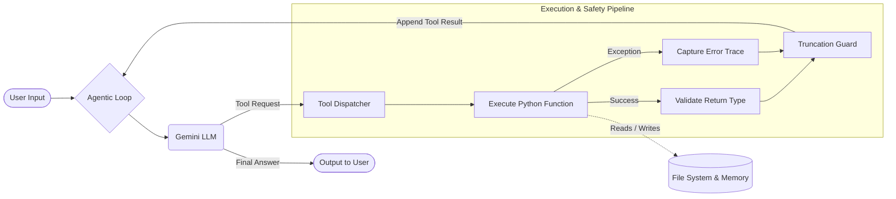

# Agent From Scratch

A simple Python-based AI agent built from scratch using the Google Gemini API. This project demonstrates core concepts of agentic workflows including tool calling, iterative execution loops, error resilience, and persistent memory.

## Features

- **Agentic Loop**: An iterative execution model that automatically reasons and dispatches tools.
- **Token Tracking**: Real-time logging of input and output token consumption per turn.
- **Error Resilience**:
  - Catches tool execution crashes (transient and logic errors).
  - Validates tool return types and formats them for the LLM.
  - Output truncation guard (`MAX_TOOL_RESULT_LENGTH`) to prevent context window overflow when dealing with large files or outputs.
- **Tools**:
  - `calculator(expression)`: Safely evaluates mathematical expressions.
  - `read_file(path)`: Reads content from files securely contained in the `test_data` directory.
  - `search_files(pattern)`: Searches file names and contents inside the `test_data` directory.
  - `save_memory(fact)`: Persists facts/notes to `agent_memory.json` across sessions.
  - `recall_memory()`: Retrieves saved memories from the persistent JSON file.
- **Fallback Models**: Automatically falls back to lighter/older models if the primary model hits rate limits or server errors.

## Getting Started

1. Clone this repository.
2. Install dependencies (e.g. `google-genai`, `python-dotenv`).
3. Set your `GEMINI_API_KEY` in the `.env` file.
4. Run `python chat.py` to start the interactive chat session.

## Architecture

The agent operates on a continuous event loop that allows it to reason, decide on actions, execute them, and interpret the results autonomously.

### What Each Part Does

- **Agentic Loop**: A `while` loop that handles the conversation flow. It runs until the LLM provides a final text response (or hits `MAX_ITERATIONS` to prevent infinite loops).
- **LLM Processing**: The Gemini model analyzes the full conversation history. If it needs external data or computation, it returns a structured "Tool Call" instead of plain text.
- **Tool Dispatcher**: A routing mechanism that matches the model's requested function name (e.g., `save_memory`) to the actual local Python function in the `TOOL_FUNCTIONS` dictionary.
- **Tool Execution & Safety**: 
  - **Exception Handling**: Runs the tool in a `try/except` block. If the tool crashes, the program doesn't break; instead, the error trace is sent back to the model so it can fix its mistake and try again.
  - **Validation**: Ensures the tool returns a string. If it returns an object or dictionary, it gracefully flags a type error.
  - **Truncation Guard**: Checks the length of the tool's output. If a file or result is too large (over 5000 chars), it slices the data and appends a `[TRUNCATED]` notice. This protects the LLM's context window from being flooded.
- **Local Environment**: The agent interacts directly with the local machine, evaluating math, reading files, searching directories, and saving persistent JSON memory data.

## What I Learned

Building this agent from scratch illuminated the "magic" behind modern AI assistants:

1. **Memory is Just Another Tool**: Long-term persistence doesn't require a special cognitive module in the model itself. By giving the model a `save_memory` function (which writes to a JSON file) and a `recall_memory` function, the model *learns* to simulate memory autonomously.
2. **Error Resilience is Critical**: In traditional software, if a function throws an exception, the app crashes. In agentic design, we *want* the LLM to see the exception. By catching errors and feeding them back as standard text, the LLM can debug itself and retry with different arguments.
3. **The Importance of Context Guards**: Giving an LLM raw access to the file system is dangerous for its context window. A simple truncation guard prevents the model from reading a 10MB file and crashing due to token limits, while still giving it enough information to realize the file was too big.
4. **Tool Descriptions Matter**: The LLM relies heavily on the `description` fields in the tool schemas. Writing clear, prompt-like instructions in the tool description (e.g., *"Use this for ANY arithmetic calculation..."*) directly dictates how effectively the agent uses its toolbox.

## Part of a series

This repo is the **orchestration layer** of a three-part exploration of the LLM stack, from math to product:

1. **[llm-stack-from-scratch](https://github.com/Diluksha-Upeka/llm-stack-from-scratch)** — the primitives layer: attention, retrieval, chunking, clustering, and IVF index in pure NumPy.
2. **agent-from-scratch** (this repo) — the orchestration layer: an agentic loop with tool calling and persistent memory, no framework.
3. **[ContextIQ](https://github.com/Diluksha-Upeka/contextiq-rag)** ([live demo](https://contextiq-rag.vercel.app/)) — the product layer: a full RAG app (FastAPI + Gemini + Pinecone) with cited, grounded answers over PDFs.
